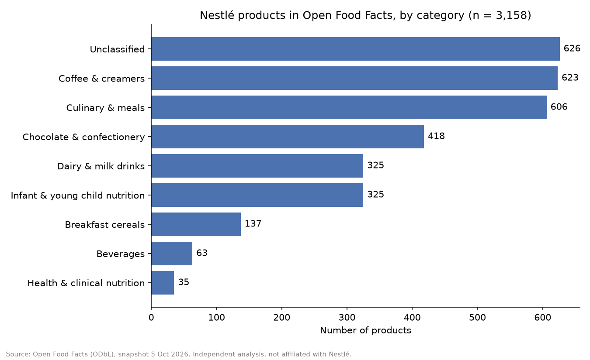
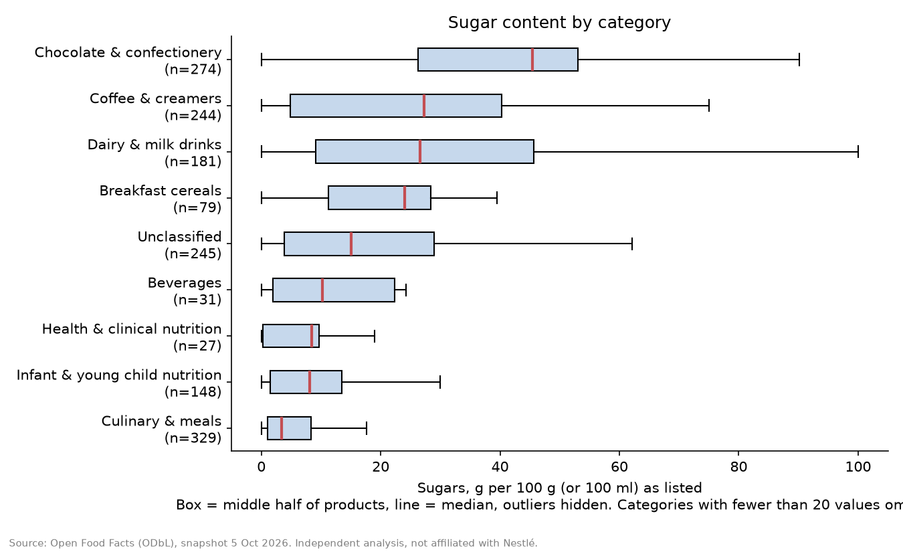
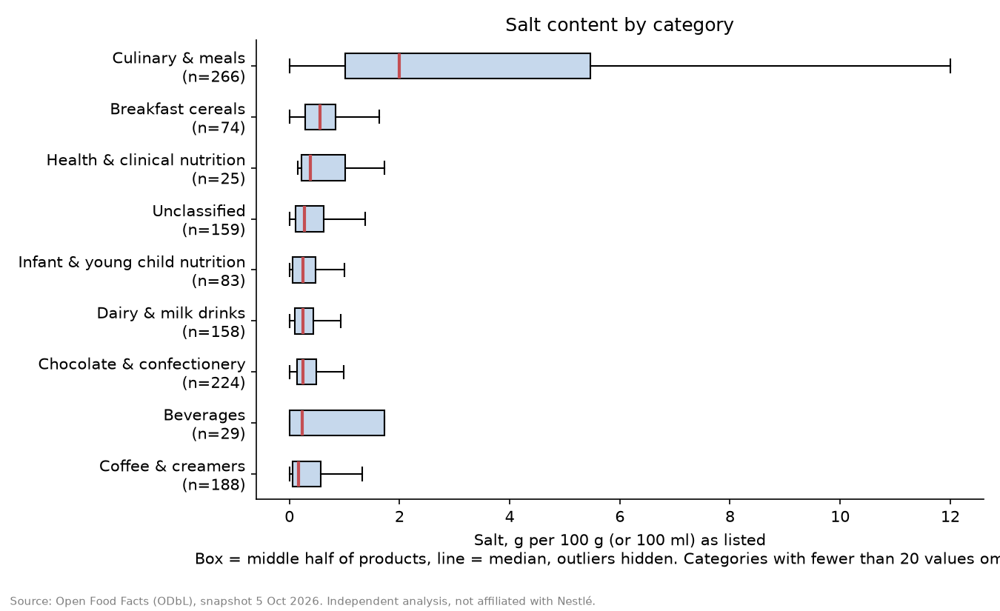
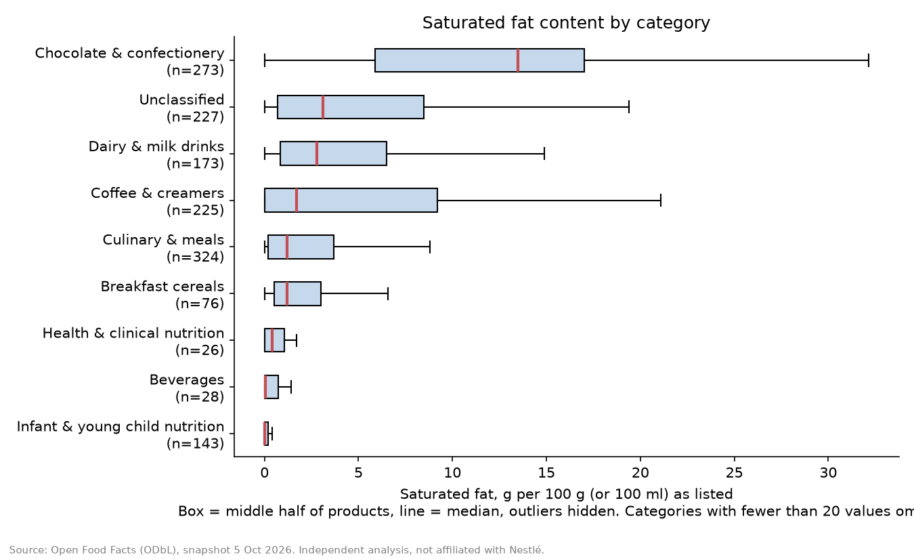
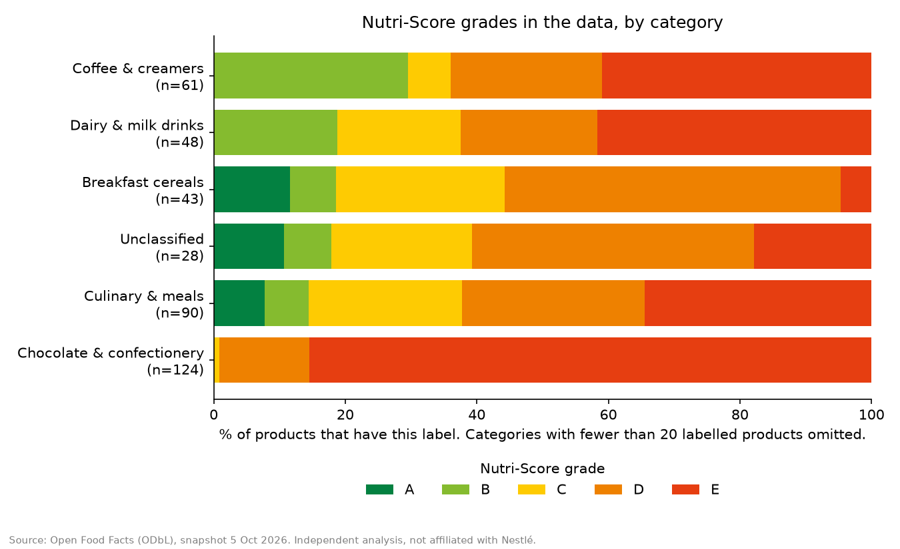
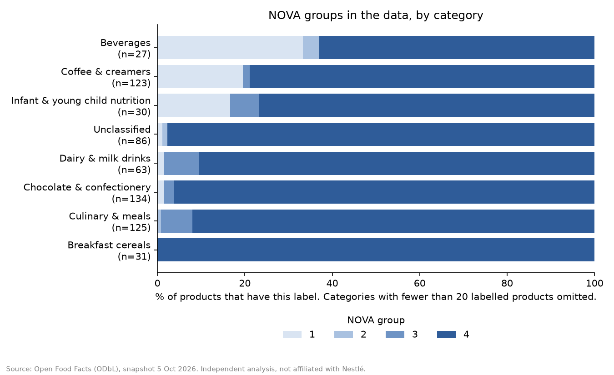
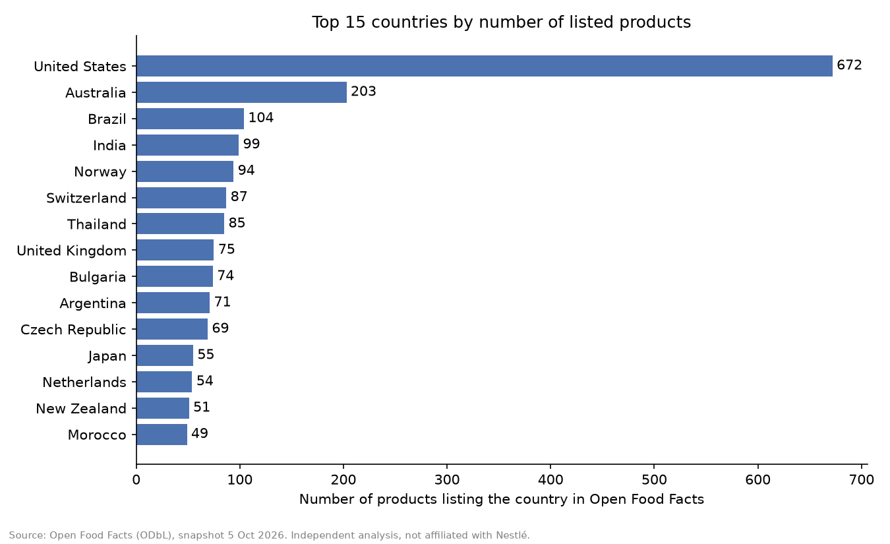

# Nestlé Product Range Analysis

Descriptive analysis of the Nestlé product range as documented in the open database
[Open Food Facts](https://world.openfoodfacts.org): how many products, which categories,
and how nutrition values, Nutri-Score and NOVA labels are distributed.
Built with Python, DuckDB and SQL.

> Independent portfolio project. Not affiliated with or endorsed by Nestlé.
> This is not sales data and not investment advice.

## Question
What does Nestlé's product range look like in Open Food Facts, and how do nutrition
values and labels vary between product categories?

## Data
- Source: Open Food Facts product database, Parquet export, snapshot of 5 Oct 2026
  (4,778,127 products in total). See `DATA_SOURCE.md`.
- License: Open Database License (ODbL). Contains information from Open Food Facts contributors.
- The raw file (7.3 GB) is not stored in this repository.

## Method
1. **Select Nestlé products** (3,158): a product is included if it has a brand tag starting with
   `nestle`, or a tag from a reviewed list of Nestlé-owned brands (`sql/brands.txt`;
   decisions in `sql/brands_decisions.md`).
2. **Clean:** flatten nested columns, remove duplicate barcodes (0 found), set impossible values
   to missing (at most 2 per nutrient), treat Nutri-Score "unknown" as missing.
   See `outputs/cleaning_log.csv`.
3. **Categorise** into 8 groups plus "Unclassified" using, in order: clear brand
   (40% of products), name/category keywords in several languages (38.5%), weak brand
   default (1.3%). 19.8% remain unclassified. See `src/05_categories.py`.
4. **Analyse in SQL** (medians and middle half per category; groups with fewer than 20 values
   are not reported) and **chart** with matplotlib.

## Key findings
Range: 3,158 Nestlé products; the largest groups are coffee and creamers (623) and
culinary and meals (606).

| Category | Products | Sugar, median g/100 g (n) | Salt, median g/100 g | Saturated fat, median g/100 g |
|---|---|---|---|---|
| Chocolate & confectionery | 418 | 45.4 (274) | 0.25 | 13.5 |
| Coffee & creamers | 623 | 27.3 (244) | 0.17 | 1.7 |
| Dairy & milk drinks | 325 | 26.6 (181) | 0.25 | 2.8 |
| Breakfast cereals | 137 | 24.0 (79) | 0.56 | 1.2 |
| Infant & young child nutrition | 325 | 8.1 (148) | 0.25 | 0.0 |
| Culinary & meals | 606 | 3.4 (329) | 1.99 | 1.2 |
| Beverages | 63 | 10.2 (31) | 0.23 | 0.1 |
| Health & clinical nutrition | 35 | 8.4 (27) | 0.38 | 0.4 |
| Unclassified | 626 | 15.0 (245) | 0.27 | 3.1 |

- **Sugar** varies most between categories: median 3.4 g per 100 g in culinary products and
  45.4 g in chocolate and confectionery.
- **Salt** is highest in culinary products (median 1.99 g per 100 g); all other categories
  have medians between 0.17 and 0.56 g.
- **Saturated fat:** chocolate and confectionery has a median of 13.5 g per 100 g; most other
  categories are below 3 g.
- **Coffee and creamers** has a wide spread (middle half of sugar values from 4.9 to 40.2 g)
  because it contains plain coffee, 3-in-1 mixes and creamers.
- **Nutri-Score** is available for only 420 products (13%). In the 124 graded products of
  chocolate and confectionery, 85.5% carry grade E; culinary products (90 graded) are spread
  across all five grades.
- **NOVA** is available for about 20% of products; group 4 is the most frequent group in every
  category with enough data (for example 96.3% of 134 chocolate and confectionery products).
- **Countries:** the United States (672 products) and Australia (203) are listed most often.

### Charts








## Limitations
- **Crowdsourced data:** contributors add products, so coverage is incomplete and uneven by
  country. Country counts show how well a country is documented, not where products are sold.
- **Not a full catalogue and no sales data:** nothing here says anything about market share
  or what people buy. Pet food is not included (separate database).
- **Missing values:** about half of the products have nutrition values; Nutri-Score and NOVA
  are available for 13% and 20%. Every statistic shows its sample size.
- **Brand matching is manual** and may miss or wrongly include some products. Brands whose
  ownership differs by country are only included when tagged `nestle`.
- **Categories are my own grouping.** 19.8% are unclassified; some products may be misfiled.
- **Nutri-Score and NOVA** are reported as labels in the data, not as quality judgements.
- Nutrition values are as entered per 100 g or 100 ml and may include prepared and unprepared forms.

## Reproduce
Requires Python 3.10+. Download the Parquet file from
https://world.openfoodfacts.org/data to `data/raw/food.parquet`, then:

```bash
python -m venv .venv && source .venv/bin/activate
pip install -r requirements.txt
python src/02_brands.py      # brand discovery (review the output)
python src/03_filter.py      # select Nestlé products
python src/04_clean.py       # flatten and clean
python src/05_categories.py  # categories
python src/06_analysis.py    # SQL analysis -> outputs/*.csv
python src/07_charts.py      # charts -> outputs/charts/
```
Results will differ slightly if you use a newer snapshot.

## Repository structure
`src/` scripts, `sql/` brand list and decisions, `outputs/` result tables and charts,
`DATA_SOURCE.md` data source and license.
